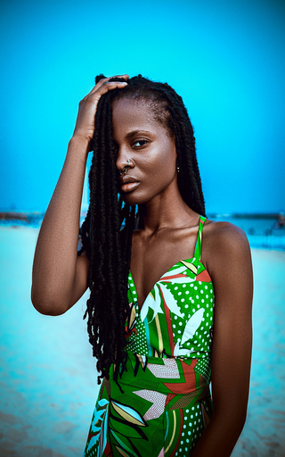
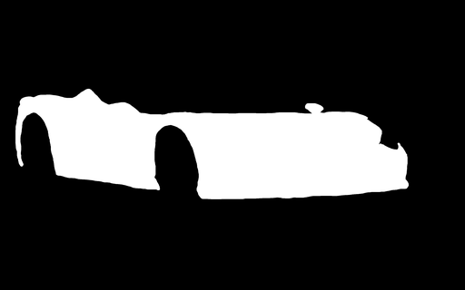

# Project Title:
# A Systematic Analysis and Comparison of Text-Guided Image Editing Models: InstructPix2Pix, Stable Diffusion Inpainting, and Kandinsky 2.1 Inpainting

**(Abstract)**
> This study aims to systematically analyze and compare the capabilities and limitations of the popular text-guided image editing models: InstructPix2Pix (IP2P), Stable Diffusion Inpainting (SD), and Kandinsky 2.1 Inpainting (Kandinsky). A diverse experimental set of 96 inputs was utilized, comprising 6 different categories (Portrait, Natural Landscape, Urban Landscape, Animals, Objects, Artistic/Other) and 8 different editing task types (Object Addition/Removal/Replacement, Color/Texture/Style/Atmosphere/Attribute Modification). The models were run at their **"native" resolutions, determined based on their respective reference implementations or recommended practices** (IP2P: 512px, SD: 512px, Kandinsky 2.1: 768px), via the Hugging Face `diffusers` library. The resulting outputs were qualitatively evaluated based on criteria such as instruction/prompt following, visual quality, fidelity to the original, structural coherence, and artifact formation. The findings reveal significant differences among the models in terms of task performance, flexibility, and failure modes. This work aims to provide a valuable resource for understanding the potential and challenges of these models in practical applications and to **demonstrate analytical research and critical evaluation skills in the field of image editing technologies**.

---

# 1. Introduction

Text-guided image editing is one of the most exciting advancements in the field of generative artificial intelligence, enabling users to modify visuals with natural language commands. Popular models with different approaches, such as InstructPix2Pix (IP2P), Stable Diffusion (SD) Inpainting, and Kandinsky Inpainting, are available in this domain. However, a systematic comparison is needed regarding the relative performance, strengths, and limitations of these models, which possess distinct architectures and operating principles, in practical editing tasks.

The **purpose** of this project is to systematically analyze and compare three prevalent models—**InstructPix2Pix (IP2P)**, **Stable Diffusion Inpainting (SD)**, and **Kandinsky 2.1 Inpainting (Kandinsky)**—in terms of their capabilities and limitations. To this end, a diverse experimental set of **96 inputs** was utilized, encompassing 6 different image categories (e.g., Portrait, Landscape) and 8 different editing task types (e.g., Object Addition/Removal, Style Transfer).

The models were run at their recommended "native" resolutions (IP2P: 512px, SD: 512px, Kandinsky: 768px) and with their **input dimensions adjusted to be multiples of 64**. The resulting outputs were qualitatively evaluated using fundamental criteria such as **instruction/prompt following, visual quality, fidelity to the original, and artifact formation**.

This study aims to reveal the potential and challenges of the specified models in practical use by presenting a comparative analysis of their performance in a controlled environment. The analysis was conducted to demonstrate an understanding and critical evaluation of current image editing technologies. **The primary contribution of this project is to offer a detailed qualitative analysis, supported by visual examples, of the behavior of these three models across various tasks and categories.**

---

## 2. Methodology

This section details the models, experimental set, experimental setup, parameters, and evaluation criteria used in the study.

### 2.1. Models Under Review

In this study, three popular models were examined for their text-guided image editing capabilities:

*   **InstructPix2Pix (IP2P):**
    *   *Checkpoint Used:* `timbrooks/instruct-pix2pix`
    *   *Operating Principle:* Edits the image directly according to a given text instruction. It does not use a mask. It was trained on paired image-instruction data.
    *   *Background Notes:* The model's training data largely consists of images generated by Stable Diffusion and instructions generated by GPT-3, utilizing the Prompt-to-Prompt (P2P) technique. This suggests that the model may exhibit stylistic similarities to SD and may be more inclined towards fine-tuning (e.g., color/style/texture changes, minor additions/removals) rather than major structural alterations.
    *   *References:* [Paper](https://arxiv.org/abs/2211.09800), [GitHub](https://github.com/timothybrooks/instruct-pix2pix), [Hugging Face](https://huggingface.co/timbrooks/instruct-pix2pix)
    * **[▶ Open InstructPix2Pix Notebook in Colab](https://colab.research.google.com/drive/1qPYQvaZgk4lkZRrGNWCy16Kz6G3P4gAw?usp=sharing)**

    

*   **Stable Diffusion Inpainting (SD):**
    *   *Checkpoint Used:* `runwayml/stable-diffusion-inpainting`
    *   *Operating Principle:* Resynthesizes a region marked by a user-provided mask in accordance with a given text prompt. It is a latent diffusion model.
    *   *References:* [Latent Diffusion Paper](https://arxiv.org/abs/2112.10752), [Hugging Face](https://huggingface.co/runwayml/stable-diffusion-inpainting)
    * **[▶ Open Stable Diffusion Inpainting Notebook in Colab](https://colab.research.google.com/drive/1v-YbcCRKYNzQD2LRPCCwEZu2O5pC4nwq?usp=sharing)**

*   **Kandinsky 2.1 Inpainting (Kandinsky):**
    *   *Checkpoints Used:* Prior: `kandinsky-community/kandinsky-2-1-prior`, Inpainting Decoder: `kandinsky-community/kandinsky-2-1-inpainting`
    *   *Operating Principle:* Like SD, it uses a mask and a prompt, but it features a two-stage architecture. First, the Prior model generates an image embedding from the text prompt. Then, the Inpainting Decoder performs the edit using this embedding, the original image, and the mask.
    *   *References:* [Blog Post](https://ai.sber.ru/publications/kandinsky-21/), [Hugging Face (Inpainting)](https://huggingface.co/kandinsky-community/kandinsky-2-1-inpainting), [Hugging Face (Prior)](https://huggingface.co/kandinsky-community/kandinsky-2-1-prior)
    * **[▶ Open Kandinsky 2.1 Inpainting Notebook in Colab](https://colab.research.google.com/drive/1fgsFpNNv1425YbxTxH8IjJATfGLCMLW3?usp=sharing)**

### 2.2. Experimental Set (Input Set)

*   *Total Inputs:* For a systematic comparison, **96** experimental inputs were created.
*   *Categories:* To ensure visual diversity, the inputs were divided into 6 main categories: **Portrait, Natural Landscape, Urban Landscape, Animals, Objects, Artistic/Other.**
*   *Task Types:* To test the different capabilities of the models, 8 distinct editing tasks were defined: **Object Addition, Object Removal, Object Replacement, Color Modification, Texture/Material Modification, Artistic Style Transfer, Atmosphere/Lighting Modification, Attribute Modification (Other).**
*   *Data Source and Selection:* Approximately 2 different sample images were compiled from various web sources to represent each Category x Task Type combination.
*   *Mask Creation:* For local edits such as object addition/removal/replacement, masks were created manually using GIMP software. For inputs requiring global edits like style transfer or atmospheric changes, the `mask_path` value was left as `null` in the `metadata.json` file. This was handled in the code by using a full white mask covering the entire image.

The 96-input experimental set used in this study (original images, masks, and the `metadata.json` file) can be accessed via the following Google Drive link:

[Research\_Project\_ImageEditing Dataset](https://drive.google.com/drive/folders/1HLcoCoYQZXODQ3916ErTSsuAm_JTDn4W?usp=sharing)

### 2.3. Metadata Structure

All information pertaining to the experimental inputs was structured in a `metadata.json` file for easy management and reproducibility. The following information was recorded for each input:
*   `entry_id`: Unique input identifier.
*   `category`: The category to which the image belongs.
*   `task_type`: The type of editing task to be applied.
*   `description`: A brief description of the task.
*   `input_image_path`: Path to the original input image.
*   `mask_path`: Path to the mask file to be used (`null` for global changes).
*   `instruction_ip2p`: The text instruction to be used for the InstructPix2Pix model.
*   `prompt_sd_k`: The text prompt to be used for the Stable Diffusion and Kandinsky models.
*   `negative_prompt`: The negative prompt used (for SD and Kandinsky) to prevent undesired outcomes.

### 2.4. Experimental Setup and Parameters

*   *Environment:* All experiments were conducted on the **Google Colab** platform, using an **NVIDIA T4 GPU (~15GB VRAM)**.
*   *Library:* The Hugging Face **`diffusers`** library was used for model inference.
*   *Execution Strategy:* Due to GPU memory constraints, batch processing was performed using separate Colab notebooks for each model family (IP2P, SD, Kandinsky).
*   *Resolution Strategy ("Native" Resolutions):* To best evaluate each model's potential within its own design parameters, the models were run at their "native" inference resolutions, as recommended in the literature or reference code:
    *   IP2P: **512px** (longest side)
    *   SD: **512px** (longest side)
    *   Kandinsky 2.1: **768px** (longest side)
*   *Image Preprocessing (Multiples of 64):*
    *   *Rationale:* Due to the convolutional layers in diffusion models (especially VAE and U-Net based ones), it is recommended that input dimensions (width and height) are typically multiples of 8, or more safely, **multiples of 64**. This improves compatibility with model architectures and reduces potential artifacts or performance degradation.
    *   *Implementation:* All input images and masks (if any) were resized to the nearest **dimensions that are a multiple of 64**, based on the target "native" resolution (using the longest side as a reference) while preserving the aspect ratio, using the `resize_image_multiple_of_64` function.
*   *Model Parameters (Held Constant):* To ensure the consistency of the comparison, the following parameters were held constant across all experiments:
    *   *IP2P:* `num_inference_steps=100`, `image_guidance_scale=1.5`, `text_guidance_scale=7.5`
    *   *SD:* `num_inference_steps=50`, `guidance_scale=7.5`
    *   *Kandinsky 2.1:* `num_inference_steps` (Prior: `25`, Decoder: `50`), `guidance_scale=4.0`

### 2.5. Evaluation Criteria

The analysis of the outputs from the models was conducted using a **qualitative** approach. The primary goal is to compare the relative performance, strengths, and weaknesses of the models on different tasks, supported by visual evidence. The main criteria used for evaluation are as follows:

1.  **Instruction/Prompt Following:** How accurately the model interprets and applies the textual input.
2.  **Visual Quality and Realism:** The naturalness, clarity, and visual aesthetics of the generated edit.
3.  **Fidelity to Original / Coherence:** The preservation of unmasked areas and the consistency of the edited region with the rest of the image (e.g., lighting, style, perspective).
4.  **Structural Integrity:** The logical and structural correctness of the edited, added, or removed objects/areas.
5.  **Artifact Formation:** The presence and type of unwanted visual errors (e.g., blurriness, color distortion, nonsensical patterns).
6.  **Adherence to Mask Boundaries:** (For SD and Kandinsky) How well the edit aligns with the provided mask area.
7.  **Task-Specific Success:** How successfully each specific task type (e.g., object addition, style transfer) was performed.

## 3. Results and Analysis

In this section, the results obtained using the methodology defined in Section 2 are presented and analyzed. The analysis is based on a qualitative comparison of the outputs from the InstructPix2Pix (IP2P), Stable Diffusion Inpainting (SD), and Kandinsky 2.1 Inpainting (Kandinsky) models on the 96-input experimental set, according to the established evaluation criteria. The findings are supported by numerous visual examples.

*   **3.1. General Performance Summary:**

    A general evaluation across the 96 inputs in the experimental set revealed significant performance differences among the three models under review.

    * **General Observations**
        * **InstructPix2Pix (IP2P)** generally produced the most satisfactory and realistic results. Despite its training data being largely composed of AI-generated images, it demonstrated a remarkable performance, especially in terms of photographic realism. If a single choice had to be made among these three models, IP2P stands out for general-purpose use.
        * **Kandinsky 2.1 Inpainting (Kandinsky)** exhibited significant creativity in interpreting prompts, often making large and bold changes in the masked areas. However, this creativity sometimes came at the cost of photorealism and led to the generation of more artifacts.
        * **Stable Diffusion Inpainting (SD)** was highly successful at conforming to the masked area and making edits consistent with its surroundings. While it generally produced more realistic results compared to Kandinsky, it did not always achieve the same consistent level of overall realism as IP2P.

    * **Comparative Table (Qualitative Evaluation):**
    
        | **Criterion** | **InstructPix2Pix** |  **Stable Diffusion (SD)** | **Kandinsky 2.1 (K)** | **Notes** |
        | ---- | ---- | ---- | ---- |---- |
        | Instruction/Prompt Following | Good | Very Good | Good | *Varies based on IP2P's instruction vs. SD/K's prompt sensitivity* |
        | Visual Quality | Very Good | Good | Fair | *IP2P for overall realism, SD for quality, K for stylistic diversity* |
        | Fidelity to Original | Good | Very Good | Good | *Preservation of unmasked areas; IP2P output is sometimes globally affected* |
        | Structural Integrity | Fair | Good | Fair  | *Logic in object addition/replacement; IP2P is weak at removal* |
        | Low Artifacts | Fair | Good | Poor | *IP2P: color/blur issues; K: more diverse artifacts* |
        | Mask Adherence | (N/A) | Very Good | Good | *IP2P is maskless; SD/K generally adhere well to mask boundaries* |

*   **3.2. Model-Specific Analysis:**
    *   **InstructPix2Pix (IP2P):**
        *   *Strengths:*
            *   **Direct Instruction Comprehension and Fast Editing:** It can directly interpret simple and clear editing instructions, producing fast results in a single forward pass without requiring a mask.
            *   **Potential in Global Changes:** In tasks where the mask covers the entire screen (i.e., global changes are intended), such as **Style Transfer** or **Atmosphere Modification**, it was observed to be capable of making impressive and holistic changes by interpreting instructions. In such tasks, it was sometimes able to produce outputs with higher photographic realism compared to the other models.
            *   **Success in Texture/Material Modification:** It occasionally produced more successful and convincing results than other models, especially in tasks like **Texture/Material Modification**.
            *   **Affinity for the Input Image (in Fine-Tuning):** Due to its Prompt-to-Prompt training technique, it has the potential to succeed in fine-tuning tasks that require high fidelity to the input image, such as minor style, color, or texture changes.
        *   *Weaknesses:*
            *   **Overall Visual Quality (in Local and Complex Tasks):** Despite its potential in global changes, it generally exhibited lower visual quality, blurriness, and loss of detail compared to Stable Diffusion and Kandinsky, especially at the 512px resolution used in this study and in tasks **requiring local edits or involving complex instructions**.
            *   **Failure in Object Removal:** It was observed to be quite unsuccessful in **Object Removal** tasks, either failing to erase the object properly or producing severe artifacts and nonsensical textures in the removed area.
            *   **Side Effects in Color Modification:** In **Color Modification** tasks, it was found to have a tendency to distort other parts of the image that should not be altered or to cause unwanted color shifts while changing the color of the target object.
            *   **Difficulty with Minor Local Edits:** In tasks aimed at modifying only a small portion of the image (e.g., **minor object additions** like adding a collar to a cat or dog), it generally failed to interpret the instruction correctly or produce satisfactory results.
            *   **Complex Instructions and Major Structural Changes:** Overall, it experienced significant difficulties in interpreting and executing complex, multi-action instructions or those requiring major structural changes (e.g., replacing objects with something entirely different, adding large objects).
        *   *Typical Errors/Artifacts:*
            *   Occasional blurriness and loss of sharpness in the outputs.
            *   In some cases, colors becoming overly vibrant or saturated, or conversely, desaturated.
            *   Failure to fully adhere to the instruction, misinterpreting the instruction, or making irrelevant changes, especially in tasks targeting small, local edits or with complex instructions.
            *   Generation of nonsensical textures, distorted structures, or severe artifacts in attempts at object removal or addition.
        *   *Visual Examples (IP2P):*

            *   **Example 1 (artistic\_style\_transfer):**
                *   *Instruction:* `Turn this photo into a watercolor painting`
                    

                    
                    
                    

                *   **Description:** This example shows how successful IP2P can be at style transfer. The color palette is softened, and details are integrated with a watercolor effect, demonstrating high adherence to the instruction.
                
            *   **Example 2 (object\_removal):**
                *   *Instruction:* `Remove the nose ring`
                    

                    
                    
                    

                *   **Description:** It removed not only the ring but also the clothes, whitened the character, and distorted the background color.

    ---
    *   **Stable Diffusion Inpainting (SD):**
        *   *Strengths:*
            *   **High Photorealism and Visual Quality:** It generally offered the highest level of photorealism, sharpness, and detail among the models reviewed, especially at 512px resolution.
            *   **Precise Adherence to Mask:** It tends to keep the edit largely within the mask boundaries by considering the provided mask area and successfully filling the masked region according to the prompt.
            *   **Fidelity to Original:** It largely preserves unmasked areas, ensuring the edit is consistent with the rest of the image.
            *   **Flexible Prompt Usage:** It offers significant control over the results through negative prompts and detailed positive prompts.
        *   *Weaknesses:*
            *   **Lack of Perfect Photorealism:** As stated in its model card, it may not always achieve a perfect level of photorealism.
            *   **Inability to Produce Legible Text:** It is poor at generating readable or meaningful text.
            *   **Compositional Challenges:** It may struggle to correctly render complex compositional relationships or the interaction of multiple objects, such as "a red cube on top of a blue sphere."
            *   **Faces and Human Figures:** Faces and people, in general, may not always be generated correctly; anatomical inconsistencies or deformations can occur.
            *   **Language Dependency:** As it was primarily trained on English captions, it may not perform as well with prompts in other languages.
            *   **Lossy Autoencoder:** The model's autoencoder (VAE) is lossy, which can lead to losses, especially in very fine details or textures.
            *   **Requires Prompt Engineering:** Achieving the desired result often requires careful and sometimes trial-and-error-based prompt engineering. The results are highly sensitive to the phrasing of the prompt.
            *   **Risk of Data Repetition and Memorization:** Due to data duplication in its training set (LAION-5B), it carries a risk of memorizing some images to a degree.
        *   *Typical Errors/Artifacts:*
            *   Slight blurriness or inconsistent transitions at the mask edges.
            *   The appearance of unwanted small objects/details not specified in the prompt but inferred from the context or resulting from the model's biases.
            *   Repetitive or artificial-looking patterns when regenerating complex textures (e.g., knitting, intricate patterns).
            *   Generation of nonsensical or distorted shapes with very abstract or rare prompts.
            *   Occasional extra/missing limbs or unnatural poses in human figures or animals.
        *   *Visual Examples (SD):*
            *   *Example Format:*

                *   **Example 1 (object\_removal):**
                    *   **Prompt:** `Empty mountain trail (or viewpoint) scenic landscape, no people`
                    *   **Negative Prompt:** `person, hiker, backpack, human figure, shadow of a person, blurry, artifact`
                    

                        
                        
                        
                    

                    *   **Description:** It removed the hiker very successfully and realistically, in a manner consistent with the mask.
                
                *   **Example 2 (texture\_material\_change):**
                    *   **Prompt:** `Large rocks made of clear, solid ice, icy texture`
                    *   **Negative Prompt:** `stone texture, normal rocks, snow covered rocks, blurry, unrealistic, water`
                    

                        
                        
                        
                    

                    *   **Description:** Not realistic at all. Some areas were not even changed.
                
    *   **Kandinsky 2.1 Inpainting (Kandinsky):**
        *   *Strengths:*
            *   **Success in Artistic and Aesthetic Styles:** It demonstrated noteworthy success compared to other models in edits requiring abstract, illustrative, and artistic styles, especially with stylized images, painterly forms, or creative scene compositions.
            *   **Broad Concept Understanding and Creative Interpretation:** It is strong at understanding and creatively interpreting more general and abstract concepts like "a magical forest" or "a dream-like city," rather than focusing on low-level details. Instead of strictly adhering to the user prompt, it can exhibit an artistic approach by sometimes adding original and surprising details.
            *   **Effort Towards Compositional Integrity:** It tends to make the edited region compositionally consistent with its surroundings. It may not just fill the masked area but attempt to create a scene that interacts with its environment.
            *   **Realism in Local Edits (Conditional):** In cases where the mask does not cover the entire image (i.e., when only a specific area is modified), it was sometimes observed to produce surprisingly realistic and contextually coherent edits.
        *   *Weaknesses:*
            *   **Low Photorealism (Especially in Global and Detailed Tasks):** In real-world images or situations where high photographic quality is expected, it generally produced less photorealistic results compared to Stable Diffusion Inpainting, particularly regarding faces, light-shadow balance, and detailed textures.
            *   **Inconsistent Adherence to Mask Boundaries:** It can sometimes show inconsistencies in strictly adhering to the provided mask area. Issues like the edit bleeding outside the mask or failing to completely fill the masked area can occur.
            *   **Loss of Detail and Simplification:** A tendency for detail loss or general simplification was frequently observed in areas with complex objects, fine lines, text, or specific surface textures.
            *   **Flexibility in Prompt Following (Can be a Drawback):** Its tendency to skip or creatively reinterpret certain elements of the prompt can be an advantage for artistic uses, but it poses a disadvantage in scenarios where precise user control is desired.
            *   **Inadequacy in Human Figure Generation:** Severe distortions, deformations, or stylistic mismatches with the rest of the image were frequently observed in complex anatomical regions like human faces, hands, and feet. In this regard, it can lag behind even Stable Diffusion Inpainting.
            *   **Inconsistencies in Style and Color Harmony:** Differences in lighting, color tones, or overall style can sometimes occur between the edited area and the rest of the image, which can compromise visual integrity.
        *   *Typical Errors/Artifacts:*
            *   Abstract, faint, incomplete, or anatomically distorted forms in faces and hands.
            *   Prominent or artificial-looking transitions at mask boundaries.
            *   Details added through the model's creative interpretation that are not specified in the prompt (sometimes unwanted), such as extra objects or unexpected colors.
            *   Perspective errors or imbalanced placement of scene elements within the composition.
            *   A low-resolution feel and an artificial appearance, especially in complex objects or overall.
        *   *Visual Examples (Kandinsky):*
            *   *Example Format:*
                *   **Example 1 (color\_change):**
                    *   *Prompt:* `Bird with bright yellow feathers`
                    *   *Negative Prompt:* `green feathers, green feathers, blurry feathers, unnatural colors`
                    

                        
                        
                        
                    

                    *   **Description:** It completed the task realistically and in good accordance with the mask and prompt.
                    
                *   **Example 2 (atmosphere\_lighting\_change):**
                    *   *Prompt:* `City skyline covered in smog, hazy atmosphere, polluted air, low visibility`
                    *   *Negative Prompt:* `clear sky, sunny day, sharp focus, clean air, fog, clouds`
                    

                        
                        
                    

                    *   **Description:** It followed the prompt but distorted the image. The change was irrelevant.

*   **3.3. Comparative Analysis by Task Type:**
    * **Object Addition**
        * *General Assessment*: In the object addition task, the models' approaches and success levels showed marked differences. Stable Diffusion Inpainting tended to produce the most realistic and visually coherent results by integrating the added object with the existing scene in terms of light, shadow, perspective, and texture. The quality of the results depended on the level of detail in the prompt and the accuracy of the mask used.
        * *InstructPix2Pix*: For object addition via instruction, it could sometimes be successful if the object to be added was not too complex and did not require major changes to the overall structure of the scene ("if not precision additions"). However, the integration of the added object with its surroundings and the overall visual quality were not as high as with SD; the added object could sometimes look artificial or cause artifacts to appear around it.
        * *Kandinsky 2.1 Inpainting*: Kandinsky took a more artistic and interpretive approach to the object addition task. Instead of strictly following the prompt, it sometimes produced interesting and creative results by interpreting the added object in its own style. However, in situations where photorealism was expected or when the prompt needed to be followed precisely, this artistic approach could cause the object to appear out of context, stylistically inconsistent, or "absurd."
        * *Comparative Example*
            * **Instruction:** `Put a summer hat on her head`
            * **Prompt (SD & Kandinsky):** `Woman wearing a stylish summer hat, outdoor portrait`
            * **Negative Prompt:** `ugly, deformed, blurry, low quality, multiple heads, bad hat, floating hat, duplicate person`

            | Input | Mask | IP2P Output | SD Output | Kandinsky Output |
            |:-----:|:-----:|:-----------:|:---------:|:----------------:|
            | | | | | |

    * **Object Removal**
        * *General Assessment*: In the task of removing an object and coherently filling the resulting area, **Stable Diffusion Inpainting** demonstrated by far the most successful performance. It generally managed to fill the space of the removed object in a visually convincing manner, consistent with the surrounding textures and structures. Although minor errors or artifacts were occasionally observed, the overall results were significantly better than those of the other models. An accurate mask that fully encompassed the object was a key factor in this model's success.
        * *InstructPix2Pix*: Experienced significant difficulties in executing object removal instructions. In most cases, it failed to remove the object completely, instead producing inadequate results such as blurring the object, partially erasing it, or creating nonsensical, distorted textures in the removed area.
        * *Kandinsky 2.1 Inpainting*: Took a different approach to this task. Instead of removing the object completely and realistically, it tended to make artistic or interpretive changes in the area intended for removal. While this sometimes manifested as a creative interpretation of the prompt or masked area, it generally failed to achieve the goal of clearly removing the object.

        * *Comparative Example*
            | Input | Mask | IP2P Output | SD Output | Kandinsky Output |
            |:-----:|:-----:|:-----------:|:---------:|:----------------:|
            || ||||
            ||| | | |
            | | | | | |

    * **Object Replacement**
        * *General Assessment*: In the task of replacing one object with another, all three models were generally found to be capable and able to produce satisfactory results. However, their approaches and the scenarios where they excelled differed.
        * *Stable Diffusion Inpainting*: Was again the leader in placing the new object with high photorealism and successful integration with the environment (light, shadow, perspective). The clarity of the masked area and the prompt directly influenced the quality of the result.
        * *InstructPix2Pix*: Was surprisingly effective, especially in cases where the instruction affected the entire image or required a large object to be replaced with a completely different one (e.g., a clear and comprehensive change like "replace the apple with a pear"). In some instances, it was able to stand out from the others in such global changes. However, the level of detail and integration of the new object might not be as flawless as with SD.
        * *Kandinsky 2.1 Inpainting*: Also produced successful results in the object replacement task. It generally placed the desired object by interpreting the prompt but sometimes combined this with its own artistic interpretation, resulting in stylized or less photorealistic outcomes. The contextual appropriateness of the replaced object was generally good.

        * *Comparative Example*
            * **Instruction:** `Replace the statue's head with a lion head`
            * **Prompt (SD & Kandinsky):** `Classical statue body with a realistic lion head`
            * **Negative Prompt:** `human head, normal statue, blurry, deformed head, mismatched texture`

            | Input | Mask | IP2P Output | SD Output | Kandinsky Output |
            |:-----:|:-----:|:-----------:|:---------:|:----------------:|
            | | | | | |

    * **Color Change**
        * *General Assessment*: In the task of changing the color of a specific object or area, the models were found to perform generally well, but with differences in their approaches and priorities.
        * *InstructPix2Pix*: Stood out, particularly in accurately following the given instruction (color and target object). It usually applied the desired color change successfully to the target area. However, it might not be as consistent as SD regarding the naturalness of color transitions or in avoiding effects on areas outside the edit.
        * *Stable Diffusion Inpainting*: Tended to perform the color change with high photorealism. It attempted to apply the new color while preserving the object's original texture and light-shadow interactions. The results were quite successful, depending on the precision of the mask and the clarity of the prompt.
        * *Kandinsky 2.1 Inpainting*: Brought a more artistic approach to the color change task. While applying the requested color, it sometimes tended to also change the overall aesthetic or style of the image, even adding artistic interpretations to unmasked parts of the original image if it deemed necessary. While this could lead to creative results, it could also produce outputs different from what was expected when only a simple color change was desired.

        * *Comparative Example*
            | Input | Mask | IP2P Output | SD Output | Kandinsky Output |
            |:-----:|:-----:|:-----------:|:---------:|:----------------:|
            | | | | | |
            | | | | | |

    * **Material Change**
        * *General Assessment*: The models' performance differed significantly in the task of changing the surface texture or material of an object (e.g., making a wooden table into marble). This task requires both the accurate application of the desired new texture/material and the preservation of the object's original form and its light interactions with the environment.
        * *InstructPix2Pix*: Performed surprisingly well in this task and generally succeeded in following the given instruction (new texture/material). Instances were observed where it was more successful than the other models at applying the new material while preserving the shape of the original object and presenting it in a visually coherent way. Its success in instruction following was key to its overall superiority in this task.
        * *Stable Diffusion Inpainting*: As usual, aimed to apply the new texture/material with high photorealism. While the results were often visually convincing, it sometimes could not reflect the specific material definition in the prompt as clearly as IP2P, or it might not provide as distinct a change in the material's fine details as IP2P achieved via instruction.
        * *Kandinsky 2.1 Inpainting*: Generally produced unrealistic results in this task. Instead of applying the desired new texture/material, it tended to create a stylized or abstract surface by adding its own artistic interpretation to the object. While this might be interesting for some creative scenarios, it fell short when a specific material change was the goal.
        
        * *Comparative Example*
            | Input | Mask | IP2P Output | SD Output | Kandinsky Output |
            |:-----:|:-----:|:-----------:|:---------:|:----------------:|
            | | | | | |
            | | | | | |

    * **Artistic Style Transfer**
        * *General Assessment*: In the task of applying an artistic style to an entire image (e.g., oil painting, cartoon, the style of a specific artist), InstructPix2Pix delivered by far the most successful and consistent performance. It managed to effectively apply the artistic style from the instruction while preserving the main contours and composition of the original image. As this is a global change (where the mask covers the entire image or is not used), IP2P's instruction-based structure appears highly suitable for this task.
        * *Kandinsky 2.1 Inpainting*: Tended to deviate significantly from the original image when interpreting artistic style transfer instructions. While attempting to apply the desired style, it could produce a completely different, sometimes unrecognizable, work by substantially altering the image's content, colors, and composition. While this could be interesting for creative explorations, it fell short in typical style transfer tasks where preserving the original content is expected.
        * *Stable Diffusion Inpainting*: Also showed a tendency to deviate somewhat from the original image when applying artistic style transfer prompts, though not as much as Kandinsky. While trying to apply the desired style, it sometimes struggled to preserve the basic structure of the image, or the application of the style was not as prominent and effective as with IP2P.
        * *Conclusion*: As a result, when the goal is to apply an artistic style while preserving the content of an existing image, InstructPix2Pix emerged as the most reliable option among these three models.
        
        * *Comparative Example*
            | Input | Mask | IP2P Output | SD Output | Kandinsky Output |
            |:-----:|:-----:|:-----------:|:---------:|:----------------:|
            | | | | | |
            | | | | | |
    
    * **Atmosphere/Lighting Change**
        * *General Assessment*: In the task of changing an image's overall atmosphere or lighting (e.g., turning day into night, adding fog, making sunny weather rainy), InstructPix2Pix and Stable Diffusion Inpainting were generally observed to produce good and viable results, while Kandinsky 2.1 Inpainting struggled with such global and fine-tuning changes.
        * *InstructPix2Pix*: Was successful at changing the atmosphere or lighting via instruction. It could alter the overall tone, lighting, and mood of the image according to the given instruction (e.g., "turn day into night," "add a foggy atmosphere"). The changes were generally applied consistently across the entire image.
        * *Stable Diffusion Inpainting*: Also produced effective results in atmospheric and lighting changes when appropriate prompts were used. It could realistically reflect the desired atmosphere by adjusting elements like the direction of light sources, the formation of shadows, and the overall color palette according to the prompt.
        * *Kandinsky 2.1 Inpainting*: Generally failed at such global atmospheric and lighting changes, producing results that could be described as completely disconnected from the original image, nonsensical, or "absurd." The model appeared to be inadequate at interpreting and applying such subtle and holistic modifications.

        * *Comparative Example*
            | Input | IP2P Output | SD Output | Kandinsky Output| Goal |
            |:-----:|:-----------:|:---------:|:---------------:|:---:|
            | | | | | Change the lighting of an interior room render to warm candlelight |
            | | | | | Place a car in a scene with heavy rain and wet reflections |

## 4. Discussion

*   **Interpretation of Findings:**

    The findings from this study have revealed significant differences in the performance of InstructPix2Pix (IP2P), Stable Diffusion (SD) Inpainting, and Kandinsky 2.1 Inpainting models on text-guided image editing tasks. Several key factors underlie these differences:
    * **Impact of Training Data and Base Models:**
        * **Stable Diffusion Inpainting's** generally high photorealism can be largely attributed to its base model, Stable Diffusion v1.5, which was trained on a massive and diverse image-text dataset like LAION-5B. This extensive training data likely enabled the model to better learn the statistics and textures of real-world visuals.
        * The fact that a significant portion of **InstructPix2Pix's** training data consists of images generated by Stable Diffusion and instructions generated by GPT-3 may explain why IP2P sometimes produces results with an aesthetic close to SD's or shows potential in areas where SD excels (e.g., certain stylistic changes). However, this indirect training process, and perhaps a smaller-scale custom training dataset, may have limited its overall visual quality and performance on complex tasks.
        * **Kandinsky 2.1 Inpainting's** unique training dataset (likely more curated or with different weightings) and its two-stage (Prior + Decoder) architecture can explain why the model tends to produce more artistic, interpretive, and sometimes less photorealistic results.
    * **Differences in Operating Mechanisms (Instruction vs. Prompt+Mask):**
        * IP2P's ability to take direct text instructions and operate without a mask appears to have been an advantage, especially for global changes (e.g., applying a style to the entire image, changing the atmosphere) or when the instruction was clear and simple. In these cases, the model's capacity to reinterpret the entire image holistically came to the forefront. However, its performance suffered in local and precision edits or with complex instructions, as it struggled to target the correct area and constrain the edit without a mask.
        * The mask-and-prompt-based operation of SD Inpainting and Kandinsky 2.1 Inpainting granted them greater control and precision in local edits. The mask clearly defined the area to be edited, while the prompt specified the details of the change to be made in that area. This approach generally yielded more successful results, particularly in tasks like object addition, removal, and replacement.
    * **The Role of Prompt/Instruction Engineering and Negative Prompts:**
        * For SD and Kandinsky, it was evident that prompt engineering played a critical role in achieving the desired outcome. The level of detail in the prompt, the keywords used, and even the word order could significantly affect the results. Furthermore, the use of negative prompts was an important tool for preventing unwanted elements (e.g., deformations, poor quality, incorrect objects) and improving the quality of the final result.
        * For IP2P, the clarity and simplicity of the instruction were of similar importance. The model struggled to interpret complex or ambiguous instructions, which led to a decline in instruction following.
    * **Importance of Mask Quality (for SD and Kandinsky):**
        * For mask-based models like SD and Kandinsky, the quality and accuracy of the mask directly influenced the success of the outcome. Masks that did not fully enclose the object, or that had missing or excess areas, led to the edit bleeding into unwanted regions or the intended change not being fully realized. This highlights the importance of creating precise masks in practical applications.
    * **Effects of "Native" Resolution and Multiple-of-64 Sizing Strategy:**
        * The decision to run the models at their recommended "native" resolutions (512px for IP2P and SD, 768px for Kandinsky) aimed to evaluate each model's potential within its own design parameters. The fact that IP2P experienced some quality issues even at 512px could be an indication that the model was perhaps trained at lower resolutions (e.g., 256px) or does not scale well to higher resolutions.
        * Adjusting the input dimensions to be multiples of 64 ensured compatibility with the architectural requirements of diffusion models (especially those containing a VAE and U-Net) and helped prevent potential artifacts or performance degradation. This is a crucial preprocessing step, especially when working with a diverse input set with varying aspect ratios.

*   **Challenges Encountered:**
    * **GPU Memory Constraints and Management:**
        * The memory capacity of the Google Colab T4 GPU environment (~15GB VRAM) used for the experiments was occasionally restrictive, especially when loading large models and working with high-resolution images. This necessitated a strategy of using separate Colab notebooks for each model family and careful memory management during batch processing. Conducting comprehensive experiments with all models at higher resolutions (e.g., 1024px and above) was not feasible due to this constraint.
    * **Creating Consistent and Precise Masks:**
        * Since the quality of the masks used for Stable Diffusion Inpainting and Kandinsky 2.1 Inpainting directly affects the results, manually creating consistent masks that accurately covered the area to be edited for 96 inputs (using GIMP) was a time-consuming and meticulous process. Drawing precise masks for objects with complex boundaries can be particularly challenging.
    * **Determining Optimal Model Parameters:**
        * Each model has its own optimal inference parameters. In this study, fixed parameter sets recommended in the literature or commonly used were chosen for each model to ensure consistency in the comparison. However, individually optimizing these parameters for each input could potentially yield better results, but this was not feasible within the scope and time constraints of this project.
    * **Qualitative and Subjective Nature of Evaluation:**
        * The evaluation of the outputs produced by the models was largely based on the defined qualitative criteria. This type of evaluation inevitably involves a degree of subjectivity. The perception of whether an edit is "successful" or "high-quality" can vary from person to person. While the use of quantitative metrics could somewhat reduce this subjectivity, these metrics also have their own limitations and were not the focus of this study.
    * **Prompt and Instruction Formulation:**
        * The sensitivity of the models (especially SD and Kandinsky) to prompts and of IP2P to instructions required careful phrasing to achieve the desired result. Different phrasings with the same meaning could lead to very different outputs from the models. Creating consistent and effective prompt/instruction sets for 96 inputs was a process that required trial-and-error and foresight.
    * **Execution Time and Data Management:**
        * Running 96 inputs with three different models, generating the outputs, and organizing them for analysis required significant time and a careful data management strategy.

*   **Model Limitations:**
    * **InstructPix2Pix (IP2P):**
        * **Visual Quality and Level of Detail:** Can be limited in terms of visual quality (sharpness, detail) compared to other models, especially when scaling to higher resolutions or in complex edits.
        * **Understanding Complex Instructions:** It struggles to correctly interpret and execute complex instructions that involve multiple steps, are abstract, or require spatial relationships (e.g., "move the object to the left") (Brooks et al., 2023).
        * **Major Structural Changes:** The model's Prompt-to-Prompt training methodology generally makes it more suited for fine-tuning and minor changes, and it can be inadequate for major structural transformations (e.g., replacing an object with a completely different one).
    * **Stable Diffusion Inpainting (SD):**
        * **No Guarantee of Perfect Photorealism:** It may not always achieve flawless photorealism; results can sometimes look artificial or "digital."
        * **Limitations in Compositional Ability:** It can struggle to accurately render complex relationships between multiple objects.
        * **Errors in Faces and Human Figures:** Faces and human anatomy, in general, may not always be generated correctly; deformations or inconsistencies can occur.
    * **Kandinsky 2.1 Inpainting:**
        * **Level of Photorealism:** Tends to produce results that are less photorealistic and more "artistic" or "painted-looking" compared to Stable Diffusion.
        * **Detail Preservation and Sharpness:** It can struggle to preserve fine details, sharp lines, or complex textures; results can sometimes appear softer or simplified.
        * **Variability in Prompt Following:** Its tendency to add creative interpretations rather than strictly adhering to the prompt can be a limitation when precise control is desired.
        * **Human Figures and Anatomy:** It can experience significant difficulties in accurately and consistently generating complex anatomical structures like human faces and hands.
        * **Coherence (Prior-Decoder Interaction):** Its two-stage structure can sometimes lead to the Decoder producing unexpected or incoherent outputs if the Prior model misinterprets the prompt.

*   **Limitations of this Study:**
    * **Size and Diversity of the Experimental Set:**
        While the 96-input experimental set aimed to cover various categories and task types, it does not represent the infinite possibilities of text-guided image editing. The performance of the models on different types of visuals or previously untested task types is beyond the scope of this study.
    * **Qualitative Nature of the Evaluation:**
        The models' performance was evaluated based on defined qualitative criteria. While this approach is valuable for understanding the practical strengths and weaknesses of the models, it can be open to subjective interpretation and may face issues of consistency between different evaluators. The lack of quantitative metrics (e.g., user satisfaction surveys, standardized visual quality scores) limits the objectivity of the findings.
    * **Fixed Model Parameters:**
        For the sake of consistency in comparison, fixed parameter sets were used for each model. However, each model, and even each input, may have its own optimal parameters. Optimizing these parameters for each input individually could have potentially allowed some models to perform better, but this was outside the scope and resources of the project.
    * **Limited Scope of Model Checkpoints Examined:**
        This study examined only specific and widely used checkpoints for each model family (InstructPix2Pix, Stable Diffusion Inpainting, Kandinsky 2.1 Inpainting). Different versions of these models, fine-tuned variants, or different checkpoints developed by the community may exhibit different performances.
    * **Hardware and Resolution Constraints:**
        The experiments were conducted in a Google Colab T4 GPU environment. The inference speeds or memory usage of the models may differ on more powerful hardware or different GPU architectures. Furthermore, although the models were run at their "native" resolutions (512px or 768px), their performance at higher resolutions (e.g., 1024px+) was not examined in detail in this study.
    * **Impact of Prompt/Instruction Engineering:**
        The performance of the models is highly sensitive to the quality and phrasing of the prompts and instructions used. Although an effort was made to create reasonable and consistent prompts/instructions in this study, it might have been possible to obtain better results from some models with a more extensive prompt engineering process.

## 5. Conclusion
This study has systematically compared the capabilities, limitations, and performance in various editing tasks of the popular text-guided image editing models: InstructPix2Pix (IP2P), Stable Diffusion (SD) Inpainting, and Kandinsky 2.1 Inpainting, using a diverse experimental set of 96 inputs.

The main findings indicate significant performance differences among the models reviewed:
* **Stable Diffusion Inpainting** stood out, generally providing the highest photorealism and precise adherence to masked areas, especially in tasks such as object addition, removal, and realistic texture/color changes. However, its performance requires careful prompt engineering.
* **InstructPix2Pix** was able to succeed, particularly in global changes (e.g., style transfer, atmosphere modification) and some texture/material modification tasks where the instruction was clear. While its maskless operation provided an advantage in some cases, it struggled with local edits and complex instructions, and its overall visual quality was lower than the other models.
* **Kandinsky 2.1 Inpainting** exhibited a more artistic and interpretive approach, capable of producing creative results, but showed more variable performance in terms of photorealism, detail preservation, and strict adherence to prompts compared to the other models.

This project has achieved its primary goal by revealing the strengths and weaknesses, behaviors across different task types, and typical failure modes of the three specified models. The resulting qualitative analysis and visual comparisons offer a valuable resource for understanding the potential and current challenges of these models in practical applications.

In conclusion, it is evident that the "best" model largely depends on the type of task, the desired level of realism, and the user's expectations for control. As image editing technologies continue to evolve rapidly, it is believed that comparative analyses of this kind will help researchers and practitioners to better understand the capabilities of these models and make informed choices.

